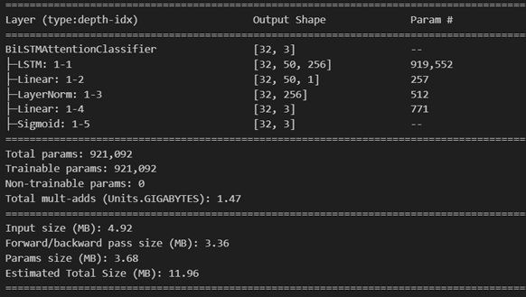
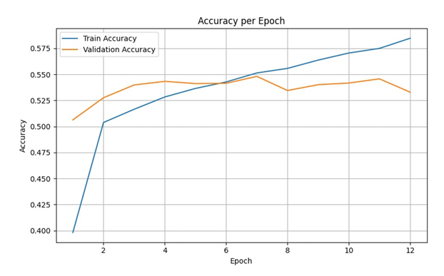
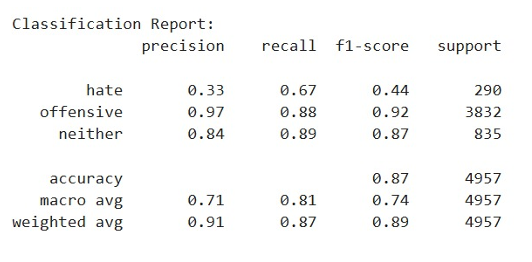

# Gender Abuse Detection in Indic Languages

> Multilingual Deep Learning Framework for Detecting Gender-Based Abuse across English, Hindi, and Tamil Social Media Posts.


---

## Overview

Online Gender-Based Violence (GBV) has become one of the fastest-growing challenges on social media platforms. Offensive comments, harassment, misogyny, and explicit abuse disproportionately target women and gender minorities, particularly in multilingual communities where moderation resources are limited.

This project develops an **automated multilingual gender abuse detection system** capable of identifying abusive content across:

- 🇬🇧 English
- 🇮🇳 Hindi
- 🇮🇳 Tamil

The project explores multiple deep learning architectures including traditional recurrent neural networks, contextual transformer models, and attention-based sequence models to understand their effectiveness for multilingual abuse detection.

---

## Motivation

Current moderation systems suffer from several limitations:

- Limited support for Indic languages
- Heavy reliance on English datasets
- Poor detection of contextual gendered abuse
- Difficulty handling class imbalance
- High moderation cost at scale

Our objective was to build models capable of understanding multilingual abusive language while improving minority class detection through data augmentation and contextual embeddings.

---

## 📸 Model Results

<table>
<tr>
<td align="center">
<b>LSTM Architecture</b><br>

</td>
<td align="center">
<b>Confusion Matrix</b><br>

</td>
</tr>

<tr>
<td align="center">
<b>Model Accuracy</b><br>

</td>
<td align="center">
<b>Classification Report</b><br>

</td>
</tr>
</table>

# Dataset

The multilingual dataset contains social media posts collected from Twitter and Instagram.

| Language | Samples |
|-----------|---------:|
| English | 7,638 |
| Hindi | 7,714 |
| Tamil | 7,914 |

Each post is annotated for:

- Gendered Abuse
- Abuse toward Marginalized Groups
- Explicit / Aggressive Content

Each annotation is represented as:

- **1** → Match
- **0** → No Match
- **NL** → Not Annotated
- **NaN** → Missing Annotation

Additionally, an English hate speech dataset containing approximately **24,783 tweets** was used for comparative model evaluation.

---

# Data Pipeline

```
Raw Tweets
      │
      ▼
Cleaning & Normalization
      │
      ▼
Tokenization
      │
      ▼
Handling Missing Values
      │
      ▼
Data Augmentation
      │
      ▼
Embedding Generation
      │
      ▼
Model Training
      │
      ▼
Evaluation
```

---

# Preprocessing

The preprocessing pipeline consisted of several stages:

### Text Cleaning

- Remove URLs
- Remove HTML entities
- Remove user mentions
- Remove unnecessary punctuation
- Normalize whitespace
- Handle emojis
- Expand contractions
- Process hashtags

---

### Missing Values

Missing annotations were either

- Mean imputed
- Removed when insignificant

---

### Handling Class Imbalance

One of the biggest challenges was the highly imbalanced class distribution.

To improve minority class performance, synonym-based augmentation was applied using:

- **nlpaug**
- **WordNet Synonym Replacement**

This produced semantically equivalent samples for minority classes, significantly improving generalization.

---

### Feature Scaling

Numerical features were normalized using:

- StandardScaler

before model training.

---

### Train/Test Split

```
Training : 80%
Testing  : 20%
```

---

# Word Embeddings

Two embedding strategies were explored.

## FastText Embeddings

- 300-dimensional vectors
- Pretrained Wiki News embeddings
- Subword modeling
- Better handling of unseen words

Unknown words were initialized using small random vectors.

---

## MuRIL Embeddings

Google's Multilingual Representation for Indian Languages (MuRIL) was used for contextual embedding generation in the attention-based architecture.

---

# Models Implemented

## 1. Simple RNN

Baseline sequential model for comparison.

### Characteristics

- Embedding Layer
- Simple Recurrent Layer
- Dense Output

---

## 2. LSTM

Designed to improve long-range dependency learning.

Architecture

```
Embedding
      │
      ▼
LSTM
      │
      ▼
Dense
      │
      ▼
Softmax
```

---

## 3. Bidirectional LSTM + Attention ⭐

Our primary deep learning architecture.

Pipeline

```
Embedding Layer
        │
        ▼
Bidirectional LSTM
        │
        ▼
Multi-Head Attention
        │
        ▼
Global Average Pooling
        │
        ▼
Dense Layer
        │
        ▼
Dropout
        │
        ▼
Softmax
```

Features

- Bidirectional Context
- Multi-head Attention
- L2 Regularization
- Dropout
- Global Average Pooling

---

## 4. BERT

Transformer-based contextual language model.

Benefits

- Context-aware representations
- Superior semantic understanding
- Strong multilingual performance

---

# Training Configuration

| Parameter | Value |
|------------|---------|
| Optimizer | Adam |
| Loss | Categorical Crossentropy |
| Activation | ReLU |
| Output | Softmax |
| Early Stopping | Patience = 3 |
| Regularization | L2 |
| Dropout | Enabled |

Class weights were automatically computed to compensate for imbalance during training.

---

# Evaluation Metrics

The models were evaluated using

- Accuracy
- Precision
- Recall
- F1 Score
- Confusion Matrix

---

# Results

## LSTM

- Moderate overall performance
- Difficulty separating **Hate** and **Offensive** classes
- Confusion matrix revealed overlapping predictions between minority classes

---

## Bidirectional LSTM + Attention

Achieved

- **≈81% Validation Accuracy**

Advantages

- Better minority class detection
- Improved contextual understanding
- More balanced predictions after augmentation

---

## BERT ⭐

Best performing model.

Achieved

- **≈83% Validation Accuracy**

Why it performed best

- Rich contextual embeddings
- Better semantic representation
- Superior understanding of multilingual text
- Stable convergence during training

---

# Model Comparison

| Model | Validation Accuracy | Remarks |
|--------|-------------------:|---------|
| Simple RNN | Baseline | Lowest performance |
| LSTM | Moderate | Better sequence learning |
| BiLSTM + Attention | ~81% | Strong contextual understanding |
| BERT | **~83%** | Best overall performance |

---

# Key Insights

- Transformer models significantly outperform recurrent architectures.
- Data augmentation noticeably improves minority class recall.
- Contextual embeddings outperform static embeddings.
- Class imbalance remains one of the primary challenges in abuse detection.
- Careful preprocessing substantially improves classification performance.

---

# Future Work

Potential improvements include

- RoBERTa
- IndicBERT
- XLM-R
- GPT-based classifiers
- Cross-validation
- Hyperparameter optimization
- Back Translation augmentation
- GPT-based paraphrase augmentation
- Real-time deployment for social media moderation
- Robustness against sarcasm and adversarial attacks

---

# Tech Stack

- Python
- TensorFlow
- Keras
- FastText
- MuRIL
- BERT
- nlpaug
- Scikit-learn
- Pandas
- NumPy

---

# Repository Structure

```
Gender-Abuse-Detection
│
├── data/
├── notebooks/
├── models/
├── embeddings/
├── preprocessing/
├── evaluation/
├── results/
├── train.py
├── inference.py
└── README.md
```

---

# Authors

- Tarandeep Singh
- Prayag Parashar
- Praddume Attri

---

# References

- Gender-Based Violence Detection Dataset
- FastText Word Embeddings
- BERT
- MuRIL
- Davidson et al. (2017)
- Waseem & Hovy (2016)
